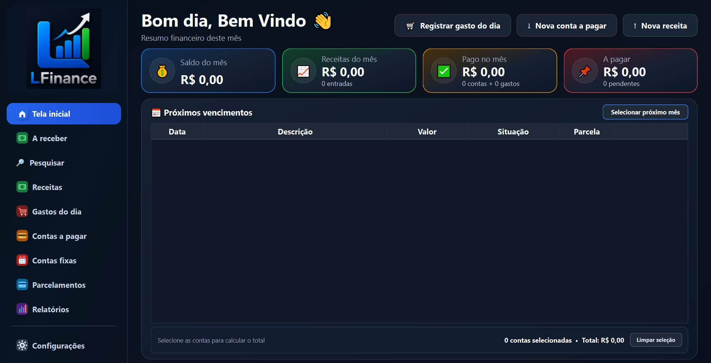

# LFinance

Sistema financeiro pessoal para Windows, desenvolvido em Python, PySide6 e SQLite.

## Versão atual

**LFinance 2.1.11**

[Baixar a versão mais recente](https://github.com/iuriloose/LFinance/releases/latest)

## Principais recursos

- Tela inicial com resumo financeiro e próximos vencimentos.
- Área **A receber** para valores previstos e recebimentos.
- Receitas, gastos do dia, contas a pagar, contas fixas e parcelamentos.
- Filtros e navegação por mês nas principais telas financeiras.
- Categorias personalizadas.
- Relatórios detalhados.
- Backup e restauração do banco de dados.
- Verificação automática de novas versões.

## Dados do usuário

Os dados ficam fora da pasta de instalação:

`%LOCALAPPDATA%\LFinance\lfinance.db`

Assim, as atualizações do programa não substituem o banco de dados.

## Atualizações

O LFinance verifica automaticamente a Release mais recente no GitHub.

Quando houver uma nova versão, o programa avisa o usuário e oferece o instalador oficial.

> Antes de instalar uma atualização, feche o LFinance.

## Desenvolvimento

Gerar executável:

`python -m PyInstaller --clean --noconfirm LFinance.spec`

Executável:

`dist\LFinance\LFinance.exe`

Gerar instalador:

`& "C:\Program Files (x86)\Inno Setup 6\ISCC.exe" ".\LFinance.iss"`

---

Desenvolvido por **Iuri Loose**.  
© 2026 Iuri Loose.